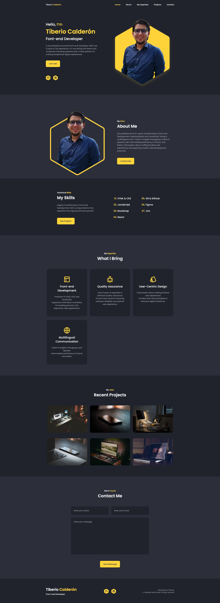

# tibe-calderon

# My Portfolio



Responsive personal portfolio website developed using HTML, CSS, and JavaScript. The site features CSS animations with a beautiful dark interface. You have the flexibility to customize the color scheme of the project. It supports sending emails through the [Email.js](https://www.emailjs.com/) API and can be easily deployed to the Internet.

## Features

- Responsive design using the Mobile First methodology.
- Beautiful dark interface with customizable color palette.
- CSS animations for a dynamic user experience.
- Contact form with email sending functionality using Email.js.
- Deployable to the Internet.

## Resources

1. [Remixicon](https://remixicon.com/) - Used for icons.
2. [Dopely Colors](https://colors.dopely.top/) - Color palette inspiration.
3. [Email.js](https://www.emailjs.com/) - API for contact email sending.
4. [ScrollReveal](https://scrollrevealjs.org/) - Library for animations.

## Usage

1. Clone the repository:

   ```bash
   git clone https://github.com/tibecvp/tibe-calderon.git
